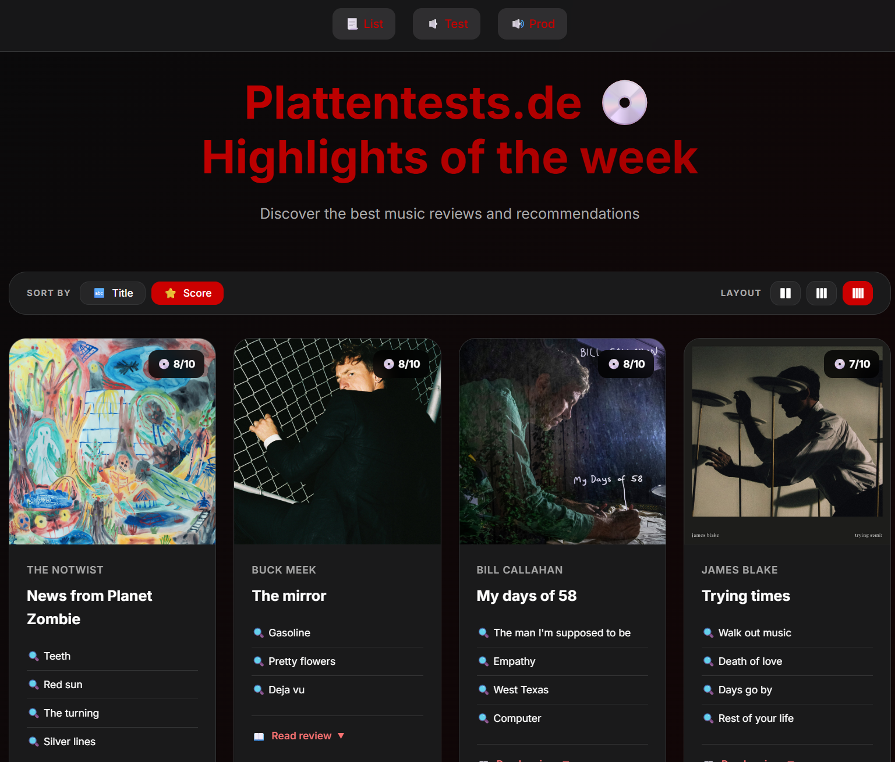

# Plattentests.de - Highlights der Woche

[](https://github.com/jetzlstorfer/plattentests-go/actions/workflows/deploy-aca.yml)
[](https://github.com/jetzlstorfer/plattentests-go/actions/workflows/codeql.yml)
[](https://github.com/jetzlstorfer/plattentests-go/actions/workflows/dependency-review.yml)


This project is a Go-based application for crawling and displaying music album reviews from Plattentests.de. It consists of multiple components, including a web crawler, playlist creator, token manager, and a modern web UI for browsing the data. The project is organized into separate directories for each component, with a clear structure for maintainability and scalability.




## Requirements

- **Go 1.25.6** or later
- Environment variables configured in `.env` file (see `env` template)

## Project Layout

```
plattentests-go/
├── cmd/                    # Command-line applications
│   ├── crawler/           # Web crawler for fetching album reviews
│   │   └── main.go
│   ├── creator/           # Playlist creation functionality
│   │   ├── main.go
│   │   └── sanitize_test.go
│   └── token/             # Authentication token management
│       └── main.go
├── internal/              # Private application code
│   └── auth/             # Authentication logic
│       └── auth.go
├── webui/                # Web frontend
│   ├── main.go           # Web server
│   ├── Dockerfile        # Container image for web UI
│   ├── assets/           # Static web assets
│   │   └── css/          # Stylesheets
│   │       ├── modern.css
│   │       └── style.css
│   └── templates/        # HTML templates
│       ├── createPlaylist.tmpl
│       ├── records.tmpl
│       └── utils.tmpl
├── go.mod                # Go module definition
├── Makefile             # Build automation
├── LICENSE              # Project license
└── env                  # Environment configuration template
```

## Components

- **Crawler** (`cmd/crawler`): Fetches album reviews and data from Plattentests.de
- **Creator** (`cmd/creator`): Creates playlists based on crawled data with sanitization features
- **Token Manager** (`cmd/token`): Handles authentication tokens for external services
- **Web UI** (`webui`): Modern web interface for browsing and interacting with album data
- **Auth** (`internal/auth`): Internal authentication and authorization logic


## Authentication

The `/createPlaylist` endpoint is protected by authentication. Two modes are supported:

| Mode | When active | How it works |
|------|-------------|--------------|
| **Azure AD Easy Auth** | Production (Azure Container Apps) | Azure's built-in authentication layer intercepts requests and forwards the signed-in user's identity via HTTP headers. No credentials need to be embedded in the app. |
| **HTTP Basic Auth** | Local development | Credentials are checked against `CREATOR_USER` and `CREATOR_PASSWORD` env vars from `.env`. |

See **[`docs/easy-auth-setup.md`](docs/easy-auth-setup.md)** for the full guide, including which manual steps are required (App Registration creation, GitHub secrets, etc.).


# Usage

💡 For your own convenience, make use of Codespaces or run it locally as devcontainer.

There is a `Makefile` with multiple targets to be used. 

- To create a token and store it in Azure:
    ```
    make token
    ```

- To run the project locally as Go binary:
    ```
    make run
    ```

- To run the project locally as a function:
    ```
    make run-function
    ```

- To run the web-frontend of the project (located in `./webui`):
    ```
    make web
    ```


