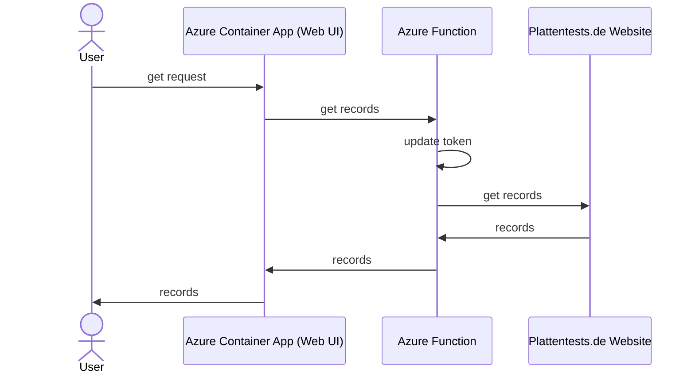
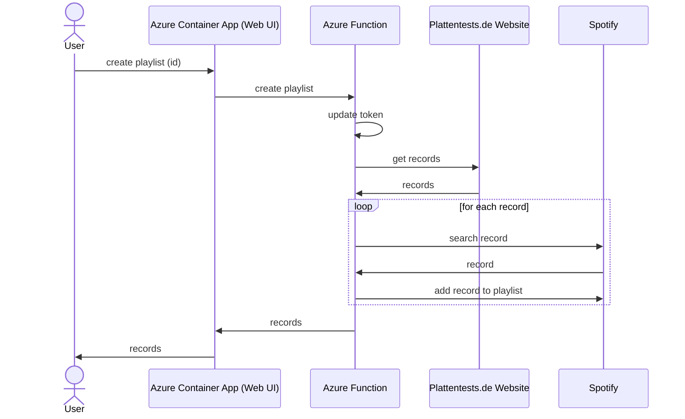

# Plattentests.de - Highlights der Woche

[](https://github.com/jetzlstorfer/plattentests-go/actions/workflows/deploy-functions.yml)
[](https://github.com/jetzlstorfer/plattentests-go/actions/workflows/deploy-aca.yml)
[](https://github.com/jetzlstorfer/plattentests-go/actions/workflows/codeql.yml)
[](https://github.com/jetzlstorfer/plattentests-go/actions/workflows/dependency-review.yml)

👨‍💻👩‍💻 **Please note that this project currently serves multiple purposes** 👨‍💻👩‍💻

1. The original purpose of generating a [Spotify playlist](https://open.spotify.com/playlist/2Bc5TRdMTj6OHwt32x5T6Y?si=c7cf976d4d124bef) that lists all "highlights" of the week of my personal favourite music website [Plattentests.de](https://plattentests.de).
1. The purpose of getting to know more about serverless and Azure functions
1. A playground for features like
   - Codespaces & devcontainers,
   - GitHub actions,
   - GitHub co-pilot and other features of GitHub.

Therefore, some commit messages might not be useful at the moment :)

# Usage


💡 For your own convenience, make use of Codespaces or run it locally as devcontainer.

There is a `Makefile` with multiple targets to be used. 
⚠️ Make sure you have the proper `ENV` variables set in a `.env` file.

- To create a token and store it in Azure:
    ```
    make token
    ```

- To run the project locally as Go binary:
    ```
    make run
    ```

- To run the project locally as a function:
    ```
    make run-function
    ```

- To run the web-frontend of the project (located in `./webui`):
    ```
    make web
    ```


## As Docker container

You can also run the project as a Docker container.

- Azure Function: 
    ```
    docker build -t plattentests-go .
    docker run -p 8080:8080 plattentests-go
    ```
- Web Frontend (make sure it points to the correct function URL)
    ```
    cd webui
    docker build -t plattentests-go-web .
    docker run -p 8081:8081 plattentests-go-web
    ```

# Architecture

## Get records




## Create Playlist


